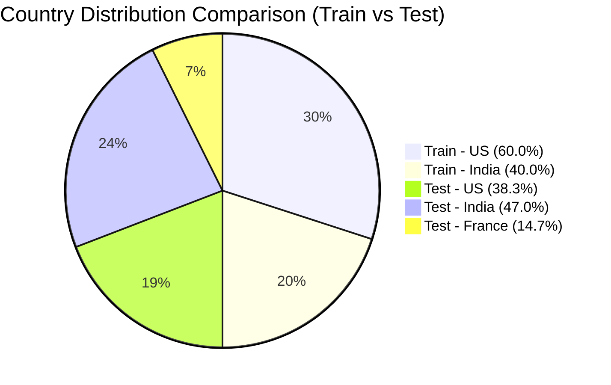
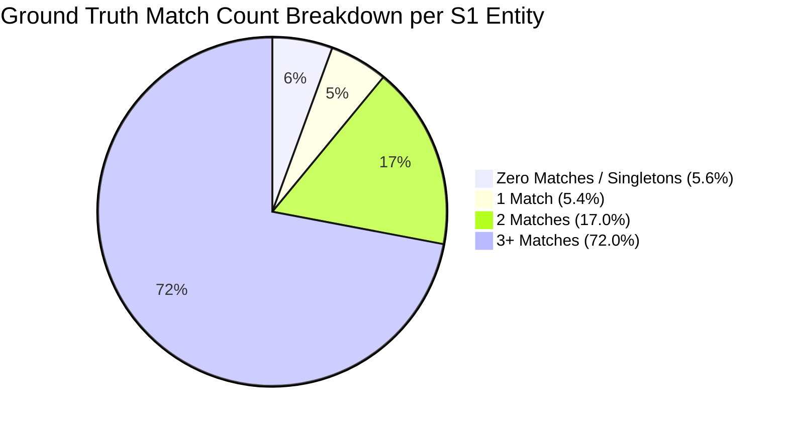
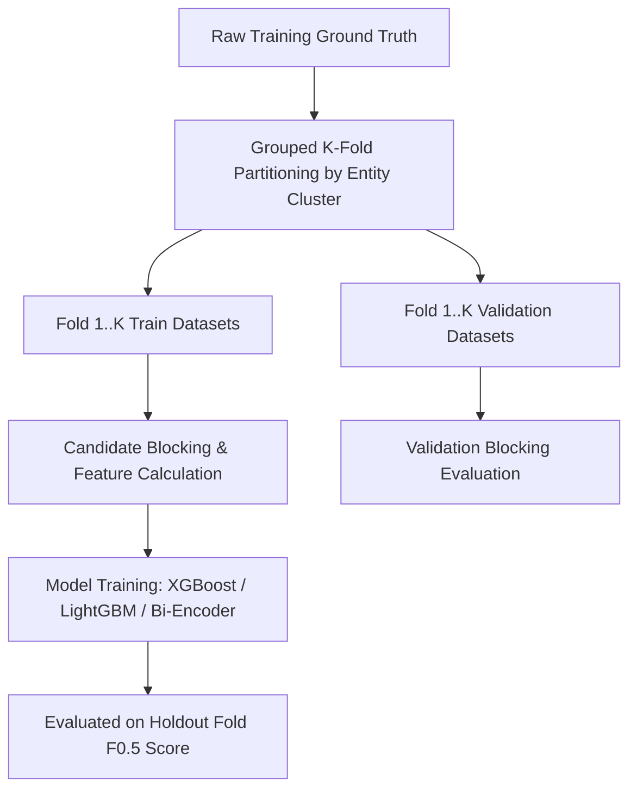

# Business Entity Resolution Challenge — Dataset Analysis & Project Plan

> [!IMPORTANT]
> **Challenge Rules Compliance Check**
> - **External Resources:** Strictly 0 external API calls, geocoding services, external business databases, or web scraping.
> - **Model Constraints:** All candidate models adhere to MIT/Apache 2.0 licenses and remain strictly under the **8 Billion parameter limit**.
> - **Geographic Adaptability:** Country-specific logic is fully parameterized — **no hardcoded US/India assumptions**, as **France (FR)** is present in the test set.
> - **Data Leakage:** Strict partition-based validation without ground-truth contamination.

---

## 1. Executive Summary & Objective

The goal of the **Business Entity Resolution Challenge** is to link multi-source business entity records across three distinct sources:
- **Source 1 ($S_1$):** Canonical/Anchor dataset containing unique base entity records.
- **Source 2 ($S_2$) & Source 3 ($S_3$):** Multi-source candidate datasets containing variation, duplicates, and distractor records.

The output requires identifying all matching $S_2$ and $S_3$ entity IDs for each anchor $S_1$ entity ID, evaluated under the **Macro $F_{0.5}$ Score** (emphasizing precision over recall).

---

## 2. Dataset Inventory & Structural Profile

### 2.1 File Summary & Row Counts

| Dataset Split | Dataset File | File Size (MB) | Total Row Count | Column Count | Primary ID Column |
| :--- | :--- | :---: | :---: | :---: | :--- |
| **Train** | `train_source1.tsv` | ~210.1 MB | **2,206,821** | 4 | `entity_id` |
| **Train** | `train_source2.tsv` | ~489.3 MB | **5,034,616** | 4 | `entity_id` |
| **Train** | `train_source3.tsv` | ~503.7 MB | **5,285,603** | 4 | `entity_id` |
| **Train** | `train_ground_truth.tsv` | ~127.0 MB | **2,206,821** | 2 | `source1_entity_id` |
| **Test** | `test_source1.tsv` | ~175.0 MB | **1,732,544** | 4 | `entity_id` |
| **Test** | `test_source2.tsv` | ~509.5 MB | **4,887,273** | 4 | `entity_id` |
| **Test** | `test_source3.tsv` | ~506.0 MB | **5,082,316** | 4 | `entity_id` |
| **Total** | **All 7 Datasets** | **~2,520.6 MB** | **26,436,000** | — | — |

### 2.2 Schema & Data Types

- **Source Files (`source1`, `source2`, `source3`):**
  - `entity_id` *(String)*: Unique alphanumeric record identifier (e.g., `S1-0000001`, `S2-0000001`, `S3-0000001`).
  - `business_name` *(String)*: Name of the business entity.
  - `business_address` *(String)*: Street, city, state, postal code string.
  - `country` *(String)*: Country code/name identifier.

- **Ground Truth (`train_ground_truth.tsv`):**
  - `source1_entity_id` *(String)*: The anchor $S_1$ entity ID.
  - `matched_entity_ids` *(String)*: Comma-separated list of matched $S_2$ and $S_3$ entity IDs (e.g., `S2-000010,S3-000045`), or empty string for singletons/unmatched $S_1$ entities.

---

## 3. Missing-Value Statistics

| Split | File Name | Column | Null / Blank Count | Missing Percentage (%) | Impact & Handling Strategy |
| :--- | :--- | :--- | :---: | :---: | :--- |
| **Train** | `train_source1.tsv` | All Columns | 0 | **0.0000%** | Complete anchor data. |
| **Train** | `train_source2.tsv` | `business_address` | 168,967 | **3.3561%** | Missing address requires heavy reliance on name similarity & blocking on name tokens. |
| **Train** | `train_source3.tsv` | `business_address` | 175,916 | **3.3282%** | Similar address missingness profile as $S_2$. |
| **Train** | `train_ground_truth.tsv` | `matched_entity_ids` | 123,247 | **5.5848%** | Represents $S_1$ entities with **zero matches** (Singletons). |
| **Test** | `test_source1.tsv` | All Columns | 0 | **0.0000%** | Complete test anchor data. |
| **Test** | `test_source2.tsv` | `business_address` | 129,408 | **2.6479%** | ~2.6% of test candidates lack address information. |
| **Test** | `test_source3.tsv` | `business_address` | 136,098 | **2.6779%** | ~2.7% of test candidates lack address information. |

> [!NOTE]
> All `entity_id`, `business_name`, and `country` fields are **100% non-null** across all train and test files.

---

## 4. Entity Uniqueness & ID Overlap Analysis

1. **Intra-File ID Uniqueness:**
   - Every file features **100% unique entity IDs**. There are **0 duplicate entity ID rows** in any dataset.
2. **Train vs. Test Entity ID Overlap:**
   - $S_1$ ID Overlap ($\text{Train} \cap \text{Test}$): **0**
   - $S_2$ ID Overlap ($\text{Train} \cap \text{Test}$): **0**
   - $S_3$ ID Overlap ($\text{Train} \cap \text{Test}$): **0**
   - **Conclusion:** The test set is a completely disjoint out-of-sample entity set. ID lookup or cross-set memorization is impossible.

---

## 5. Country Distribution & Geographic Domain Shift

> [!WARNING]
> **Domain Shift Detected: France Present in Test Set**
> While the training dataset contains **only US and India**, the test dataset introduces **France (14.5% of test data)**. Hardcoding or assuming country-specific rules (e.g., US ZIP vs India PIN regexes only) will fail on the test set!



| Dataset Split | File Name | US Count (%) | India Count (%) | France Count (%) | Total Records |
| :--- | :--- | :---: | :---: | :---: | :---: |
| **Train** | `train_source1` | 1,323,633 (59.98%) | 883,188 (40.02%) | 0 (0.00%) | 2,206,821 |
| **Train** | `train_source2` | 3,016,817 (59.92%) | 2,017,799 (40.08%) | 0 (0.00%) | 5,034,616 |
| **Train** | `train_source3` | 3,170,056 (59.98%) | 2,115,547 (40.02%) | 0 (0.00%) | 5,285,603 |
| **Test** | `test_source1` | 663,106 (38.27%) | 809,986 (46.75%) | **259,452 (14.98%)** | 1,732,544 |
| **Test** | `test_source2` | 1,871,330 (38.29%) | 2,312,565 (47.32%) | **703,378 (14.39%)** | 4,887,273 |
| **Test** | `test_source3` | 1,945,701 (38.28%) | 2,405,000 (47.32%) | **731,615 (14.40%)** | 5,082,316 |

### Country Constraint Strategy:
- **Strict Country Blocking:** Entities in $S_1$ can **only** match candidates in $S_2$ and $S_3$ from the **same country**. Cross-country candidate pairs are 100% invalid.
- **Language-Agnostic Feature Engineering:** Use character n-grams, multilingual embedding models, and generic token distance metrics rather than language-specific or country-specific hardcoded dictionaries.

---

## 6. Business Name Morphological Statistics

| Dataset Split | Source | Min Chars | Max Chars | Mean Chars | Median Chars | Min Words | Max Words | Mean Words | Median Words |
| :--- | :--- | :---: | :---: | :---: | :---: | :---: | :---: | :---: | :---: |
| **Train** | `source1` | 3 | 105 | 24.03 | 24 | 1 | 16 | 3.55 | 4 |
| **Train** | `source2` | 2 | 104 | 25.10 | 25 | 1 | 15 | 3.50 | 4 |
| **Train** | `source3` | 2 | 123 | 25.20 | 25 | 1 | 18 | 3.53 | 4 |
| **Test** | `source1` | 3 | 92 | 23.84 | 24 | 1 | 14 | 3.52 | 4 |
| **Test** | `source2` | 2 | 102 | 25.70 | 25 | 1 | 15 | 3.59 | 4 |
| **Test** | `source3` | 2 | 103 | 25.66 | 25 | 1 | 16 | 3.60 | 4 |

**Observations:**
- Business names average ~24-25 characters and ~3.5 words.
- $S_2$ and $S_3$ display slightly longer maximum character lengths due to inclusion of legal suffixes (e.g., *LLC, Corp, Pvt Ltd, Inc, SARL*).

---

## 7. Business Address Pattern & Structural Analysis

### 7.1 Address Length & Word Count Distributions

| Dataset Split | Source | Min Chars | Max Chars | Mean Chars | Median Chars | Min Words | Max Words | Mean Words | Median Words |
| :--- | :--- | :---: | :---: | :---: | :---: | :---: | :---: | :---: | :---: |
| **Train** | `source1` | 11 | 256 | 52.07 | 41 | 2 | 43 | 8.03 | 7 |
| **Train** | `source2` | 0 | 249 | 46.23 | 37 | 0 | 46 | 7.29 | 6 |
| **Train** | `source3` | 0 | 240 | 46.71 | 42 | 0 | 43 | 7.17 | 6 |
| **Test** | `source1` | 11 | 268 | 57.21 | 50 | 2 | 43 | 8.59 | 8 |
| **Test** | `source2` | 0 | 269 | 50.41 | 43 | 0 | 43 | 7.80 | 7 |
| **Test** | `source3` | 0 | 267 | 48.74 | 43 | 0 | 43 | 7.51 | 7 |

### 7.2 Address Pattern Signals & Numeric Content

| Dataset Split | Source | Total Records | Has Digits Count (%) | 5-Digit US ZIP Pattern (%) | 6-Digit IN PIN Pattern (%) |
| :--- | :--- | :---: | :---: | :---: | :---: |
| **Train** | `source1` | 2,206,821 | 2,129,784 (96.51%) | 145,601 (6.60%) | 1,656 (0.08%) |
| **Train** | `source2` | 5,034,616 | 4,563,675 (90.65%) | 327,300 (6.50%) | 41,851 (0.83%) |
| **Train** | `source3` | 5,285,603 | 4,799,297 (90.80%) | 343,630 (6.50%) | 42,140 (0.80%) |
| **Test** | `source1` | 1,732,544 | 1,660,706 (95.85%) | 74,808 (4.32%) | 826 (0.05%) |
| **Test** | `test_source2` | 4,887,273 | 4,529,243 (92.67%) | 221,147 (4.52%) | 26,789 (0.55%) |
| **Test** | `test_source3` | 5,082,316 | 4,700,823 (92.50%) | 229,317 (4.51%) | 26,777 (0.53%) |

---

## 8. Ground-Truth Match Analysis & Structural Topology

### 8.1 Match Distribution Metrics per $S_1$ Entity

- **Total $S_1$ Entities evaluated in Ground Truth:** `2,206,821`
- **Match Count Range:** Minimum `0`, Maximum `11`
- **Mean Match Count:** `3.4613`
- **Median Match Count:** `3.0`
- **Percentiles:**
  - **25th Percentile:** 2 matches
  - **75th Percentile:** 5 matches
  - **90th Percentile:** 6 matches
  - **99th Percentile:** 8 matches

### 8.2 Categorical Match Breakdown (Singletons vs Multi-Matches)

| Match Bucket | Match Count Range | S1 Entity Count | Percentage (%) | Strategy & Tactical Significance |
| :--- | :---: | :---: | :---: | :--- |
| **Zero Matches (Singletons)** | 0 | 123,247 | **5.58%** | Models must learn thresholding to predict empty match lists. |
| **Single Match** | 1 | 119,157 | **5.40%** | Exactly 1 matching candidate ($S_2$ or $S_3$). |
| **Double Matches** | 2 | 375,212 | **17.00%** | Typically 1 match in $S_2$ + 1 match in $S_3$. |
| **Multi-Matches (3+)** | $\ge 3$ | 1,589,205 | **72.01%** | Majority case (multiple candidates from $S_2$ and $S_3$). |



### 8.3 Ground Truth Match Frequency Histogram

```
Match Count | Frequency      | Count
------------|----------------|--------
    0       | ███            | 123,247
    1       | ███            | 119,157
    2       | █████████      | 375,212
    3       | █████████████  | 530,841
    4       | ████████████   | 484,115
    5       | ████████       | 321,957
    6       | ████           | 164,868
    7       | ██             | 63,968
    8       | █              | 18,680
    9       | ▏              | 4,205
    10      | ▏              | 534
    11      | ▏              | 37
```

---

## 9. $S_2$ and $S_3$ Candidates in Ground Truth vs. Distractors

### 9.1 Coverage & Distractor Pool Analysis

| Candidate Source | Total Records in Train | Matches in Ground Truth | Unique Matched Entities | Coverage Pct (%) | Unmatched Distractors | Distractor Pct (%) |
| :--- | :---: | :---: | :---: | :---: | :---: | :---: |
| **Source 2 ($S_2$)** | 5,034,616 | 3,693,619 | 3,693,619 | **73.36%** | 1,340,997 | **26.64%** |
| **Source 3 ($S_3$)** | 5,285,603 | 3,944,746 | 3,944,746 | **74.63%** | 1,340,857 | **25.37%** |

> [!IMPORTANT]
> **Key Insight: Disjoint 1-to-N Structural Property**
> - **$S_2$ Multi-Match to $S_1$:** Exactly **0** $S_2$ entities match to more than one $S_1$ entity.
> - **$S_3$ Multi-Match to $S_1$:** Exactly **0** $S_3$ entities match to more than one $S_1$ entity.
> - **Mathematical Constraint:** Ground truth forms a **strict partition**. Each candidate record in $S_2$ or $S_3$ belongs to **at most ONE** $S_1$ entity. This structural property allows post-processing optimization (e.g. 1-to-N global assignment / maximum weight matching).

---

## 10. Duplicate Records & Content Anomalies

| Dataset Split | Source File | Exact Full Duplicate Rows | Content Duplicates (Excluding `entity_id`) | Percentage Duplicate Content |
| :--- | :--- | :---: | :---: | :---: |
| **Train** | `train_source1.tsv` | 0 | 0 | 0.00% |
| **Train** | `train_source2.tsv` | 0 | **25,873** | 0.51% |
| **Train** | `train_source3.tsv` | 0 | **18,860** | 0.36% |
| **Test** | `test_source1.tsv` | 0 | 0 | 0.00% |
| **Test** | `test_source2.tsv` | 0 | **22,641** | 0.46% |
| **Test** | `test_source3.tsv` | 0 | **16,293** | 0.32% |

---

## 11. Potential Data-Quality & Engineering Challenges

1. **Address Missingness in Candidates:** ~3.3% of $S_2$ and $S_3$ records lack addresses. Candidate generation must handle name-only blocking.
2. **Text Noise & Abbreviation Sprawl:** Variations in legal structure naming (e.g., *S.A.R.L.* vs *SARL*, *Pvt. Ltd.* vs *Limited*, *St.* vs *Street*).
3. **Scale & Computational Constraints:** Evaluating 1.7M $S_1$ entities against 4.8M $S_2$ and 5.0M $S_3$ records yields **~17 trillion potential pairs**. Fast blocking is mandatory.

---

## 12. Potential Data Leakage Risks & Mitigation Strategies



1. **Entity-Cluster Leakage across Validation Folds:**
   - *Risk:* Splitting records randomly across folds would leak ground-truth entity cluster structures into training folds.
   - *Mitigation:* Implement **Grouped K-Fold Split** by anchor $S_1$ entity ID and its associated ground-truth candidate clusters.
2. **Out-of-Domain Geographic Leakage:**
   - *Risk:* Overfitting country-specific feature weights to US/India regexes causes performance drop on France test set.
   - *Mitigation:* Evaluate models on a simulated out-of-domain holdout fold.
3. **Threshold Overfitting on Precision ($F_{0.5}$ metric):**
   - *Risk:* Optimizing match probability thresholds directly on the entire training set causes over-confidence.
   - *Mitigation:* Tune decision thresholds strictly within out-of-fold validation predictions.

---

## 13. Strategic Roadmap & Next Steps Plan

### Phase 1: High-Recall Multi-Pass Blocking (Candidate Generation)
- **Goal:** Reduce 17 Trillion candidate pairs to $< 100$ candidates per $S_1$ entity while preserving $> 98\%$ candidate recall.
- **Pass 1:** Exact Country Match + Exact Normalized Name Prefix / MinHash LSH.
- **Pass 2:** TF-IDF Character & Word N-gram cosine similarity (top-k).
- **Pass 3:** Token Sort / Address PIN code blocking.

### Phase 2: Feature Engineering Matrix
- **String Distance Metrics:** Levenshtein, Jaro-Winkler, Monge-Elkan, Jaccard, Cosine.
- **Address Breakdown:** Numeric house number agreement, postal code match, token overlap ratio.
- **Structural Features:** Relative frequency of business name terms (IDF weighting).

### Phase 3: Binary Classification Modeling & Post-Processing
- **Models:** LightGBM / CatBoost / XGBoost ensemble + optional Transformer Bi-Encoder (under 8B parameters).
- **Metric Optimization:** Threshold selection targeted at maximizing **Macro $F_{0.5}$ Score**.
- **Post-Processing:** Strict candidate-to-S1 constraint enforcement and formatting checks via `utils/validate_submission.py`.
