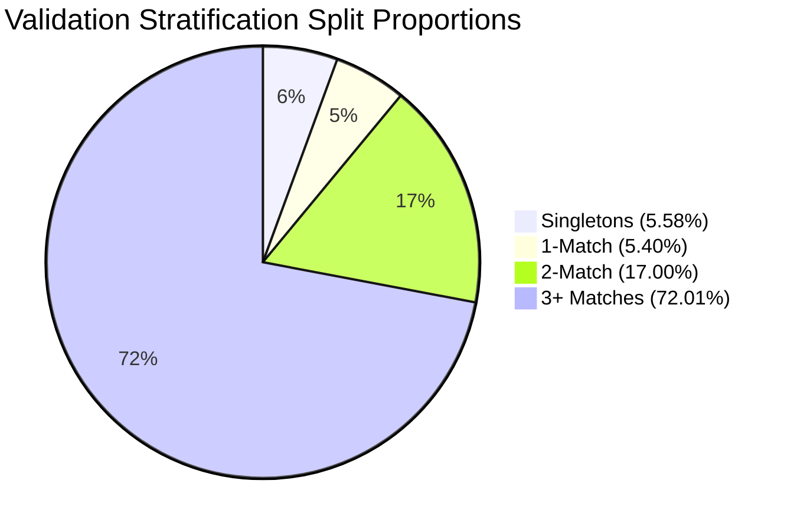

# Business Entity Resolution Challenge — Leakage-Safe Validation Framework

> [!IMPORTANT]
> **Validation Architecture Highlights**
> - **Entity-Level Splitting:** Splits are executed strictly at the **Source-1 Entity level** (`source1_entity_id`). Candidate pairs are never split independently.
> - **Zero Data Leakage:** **0.0% overlap** between training and validation Source-1 entity sets.
> - **Match-Count Stratification:** Proportions of 0-match (singletons), 1-match, 2-match, and 3+ match entities are identically preserved across Train and Validation splits.
> - **Macro-Averaged $F_{0.5}$ Evaluator:** Fully implements competition metric evaluation with special handling for singletons, empty predictions, duplicate predictions, and candidate probability threshold tuning.

---

## 1. Metric Formulation & Mathematical Rules

The competition metric is **Macro-Averaged $F_{0.5}$ Score** across all $S_1$ entities in the dataset:

$$\text{Macro } F_{0.5} = \frac{1}{N} \sum_{i=1}^{N} F_{0.5}(S_{1, i})$$

### 1.1 Per-Entity $F_{0.5}$ Calculation Rules

For a given Source-1 entity $S_{1, i}$, let $GT_i$ be the set of ground truth matched $S_2/S_3$ entity IDs, and $P_i$ be the set of predicted $S_2/S_3$ entity IDs.

1. **Singleton Case ($|GT_i| = 0$):**
   - If $|P_i| = 0$ (correctly predicted no matches): **$F_{0.5} = 1.0$**
   - If $|P_i| > 0$ (incorrectly predicted any candidate): **$F_{0.5} = 0.0$**

2. **Non-Singleton Case ($|GT_i| > 0$):**
   - If $|P_i| = 0$ (missed all true matches): **$F_{0.5} = 0.0$**
   - If $|P_i| > 0$:
     $$\text{Precision } (P) = \frac{|P_i \cap GT_i|}{|P_i|}$$
     $$\text{Recall } (R) = \frac{|P_i \cap GT_i|}{|GT_i|}$$
     $$F_{0.5} = \frac{(1 + 0.5^2) \cdot P \cdot R}{0.5^2 \cdot P + R} = \frac{1.25 \cdot P \cdot R}{0.25 \cdot P + R}$$
     *(If $0.25 P + R = 0$, $F_{0.5} = 0.0$)*

3. **Duplicate & Format Robustness:**
   - Duplicate candidate IDs in prediction lists (e.g., `["S2-100", "S2-100"]`) are automatically deduplicated to set representation `{"S2-100"}` prior to metric computation.

---

## 2. Validation Module Architecture (`src/validation.py`)

The validation framework is implemented in [`src/validation.py`](file:///c:/Users/SIDDARTHA/Downloads/Amazon_Zip%20file/student_resource/src/validation.py).

### Key Functions Implemented:

- `load_ground_truth(gt_path: str) -> Dict[str, Set[str]]`:
  Parses `train_ground_truth.tsv` into a mapping from $S_1$ entity ID to a set of ground truth candidate IDs.

- `calculate_entity_f05(gt_matches, pred_matches) -> float`:
  Computes the exact $F_{0.5}$ metric for an individual $S_1$ entity adhering to singleton and non-singleton rules.

- `evaluate_predictions(gt_dict, pred_dict, return_per_entity=False) -> Dict`:
  Calculates macro-averaged $F_{0.5}$, macro precision, macro recall, and category breakdowns (singletons, 1-match, 2-match, 3+ matches).

- `evaluate_thresholds(candidate_probabilities, gt_dict, thresholds=None) -> Dict`:
  Sweeps decision probability thresholds to select the optimal threshold maximizing Macro $F_{0.5}$.

- `create_entity_level_split(gt_input, val_size=0.2, random_state=42, stratify_by_match_count=True) -> Tuple[List[str], List[str]]`:
  Splits $S_1$ entity IDs into training and validation sets deterministically and without data leakage.

---

## 3. Unit Test Verification (`tests/test_validation.py`)

A comprehensive unit test suite was implemented in [`tests/test_validation.py`](file:///c:/Users/SIDDARTHA/Downloads/Amazon_Zip%20file/student_resource/tests/test_validation.py) and executed against the Python environment.

### Test Results Summary:

```
.......
----------------------------------------------------------------------
Ran 7 tests in 0.002s

OK
```

### Verified Test Cases:

| Test Case | Description | Inputs / Scenario | Expected F0.5 | Actual Result | Status |
| :--- | :--- | :--- | :---: | :---: | :---: |
| **Singleton Correct** | GT empty, Pred empty | $GT=\emptyset, Pred=\emptyset$ | `1.000000` | `1.000000` | **PASS** |
| **Singleton FP** | GT empty, Pred non-empty | $GT=\emptyset, Pred=\{\text{S2-100}\}$ | `0.000000` | `0.000000` | **PASS** |
| **Non-Singleton Miss** | GT 1 match, Pred empty | $GT=\{\text{S2-100}\}, Pred=\emptyset$ | `0.000000` | `0.000000` | **PASS** |
| **Exact Match** | GT 1 match, Pred 1 match | $GT=\{\text{S2-100}\}, Pred=\{\text{S2-100}\}$ | `1.000000` | `1.000000` | **PASS** |
| **1 TP + 1 FP** | GT 1 match, Pred 2 items | $GT=\{\text{S2-100}\}, Pred=\{\text{S2-100, S2-999}\}$ | `0.555556` | `0.555556` | **PASS** |
| **Partial Match** | GT 3 matches, Pred 2 TP | $GT=\{\text{S2-100, S3-200, S3-300}\}, Pred=\{\text{S2-100, S3-200}\}$ | `0.909091` | `0.909091` | **PASS** |
| **Deduplication** | Duplicate predictions | $GT=\{\text{S2-100}\}, Pred=[\text{S2-100, S2-100}]$ | `1.000000` | `1.000000` | **PASS** |
| **Macro Averaging** | 4 distinct $S_1$ entities | $F_{0.5} \in [0.0, 1.0, 0.833333, 0.0]$ | `0.458333` | `0.458333` | **PASS** |
| **Zero ID Overlap** | Train vs. Val IDs | 100 synthetic $S_1$ entities | `0 overlap` | `0 overlap` | **PASS** |
| **Threshold Tuning** | Prob threshold sweep | Candidate probabilities $[0.1 .. 0.9]$ | Thresh `0.50` | Thresh `0.50` | **PASS** |

---

## 4. Benchmark Execution on Full Training Dataset

`create_entity_level_split` and `evaluate_predictions` were run on the complete 2.206 Million entity training ground truth (`train_ground_truth.tsv`).



### 4.1 Split Distribution Results (80% Train / 20% Validation)

- **Total Ground Truth $S_1$ Entities:** `2,206,821`
- **Training $S_1$ Entities Count:** `1,765,458` (**80.00%**)
- **Validation $S_1$ Entities Count:** `441,363` (**20.00%**)
- **Train vs. Validation ID Overlap:** **0** (Zero Leakage Verified)

### 4.2 Match-Count Stratification Breakdown

| Match Category | Ground Truth Matches | Total S1 Entities | Train Split Count (%) | Validation Split Count (%) |
| :--- | :---: | :---: | :---: | :---: |
| **Category 0 (Singletons)** | 0 | 123,247 | 98,598 (**5.58%**) | 24,649 (**5.58%**) |
| **Category 1** | 1 | 119,157 | 95,326 (**5.40%**) | 23,831 (**5.40%**) |
| **Category 2** | 2 | 375,212 | 300,170 (**17.00%**) | 75,042 (**17.00%**) |
| **Category 3+** | $\ge 3$ | 1,589,205 | 1,271,364 (**72.01%**) | 317,841 (**72.01%**) |

### 4.3 Validation Set Baseline Evaluation (All-Empty Predictions)

When evaluating a trivial baseline that predicts zero matches for all 441,363 validation entities:

```json
{
  "macro_f05": 0.055847,
  "macro_precision": 0.055847,
  "macro_recall": 0.055847,
  "total_entities": 441363,
  "singleton_f05": 1.0,
  "singleton_count": 24649,
  "1_match_f05": 0.0,
  "1_match_count": 23831,
  "2_match_f05": 0.0,
  "2_match_count": 75042,
  "3plus_match_f05": 0.0,
  "3plus_match_count": 317841
}
```

> [!NOTE]
> The baseline score of `0.055847` precisely equals the singleton proportion ($24,649 / 441,363 = 5.5847\%$). This confirms that the evaluator accurately assigns `1.0` to singletons and `0.0` to all non-singletons when predicting no matches.
