# Business Entity Resolution Challenge — Multi-View Normalization System

> [!IMPORTANT]
> **Multi-View Normalization System Principles**
> - **Zero Loss of Information:** Original input strings (`original_name`, `original_address`, `original_country`) are retained intact without modification.
> - **10 Distinct Name Views:** Derived representations cover case, Unicode NFKD, punctuation removal, whitespace collapsing, abbreviation expansion, legal suffix standardization, legal suffix removal, compact alphanumeric strings, token lists, and sorted token strings.
> - **10 Distinct Address Views:** Derived representations cover street abbreviation expansion, numeric token extraction, 5/6-digit postal code parsing, region/city token extraction, and compact strings.
> - **Open-Set Country Handling:** Country normalization is completely open-set (case/whitespace clean) without any hardcoded country lists.
> - **Multilingual & Multicountry Support:** Fully handles French (*SARL*, *SA*, accents), US (*Inc*, *Corp*, *LLC*, 5-digit ZIP), and Indian (*Pvt Ltd*, 6-digit PIN) naming and address patterns.

---

## 1. Architecture & Design Motivation

Entity resolution across heterogeneous sources requires comparing entity attributes at multiple levels of granularity:
- Exact blocking requires **compact/normalized token representations** (e.g., `amazoninc` or `[amazon]`).
- Semantic matching requires **abbreviation-expanded representations** (e.g., `corp` $\rightarrow$ `corporation`).
- Robust distance calculations require **name representations without legal suffixes** (e.g., comparing `Amazon` vs `Amazon LLC`).

The multi-view normalization system is implemented in [`src/normalization.py`](file:///c:/Users/SIDDARTHA/Downloads/Amazon_Zip%20file/student_resource/src/normalization.py).

---

## 2. Derived Representations Breakdown

```mermaid
flowchart TD
    Raw[Raw Business Record] --> Orig[Preserved Original Values]
    Raw --> NamePipeline[Name Normalization Engine]
    Raw --> AddrPipeline[Address Normalization Engine]
    Raw --> CtryPipeline[Open-Set Country Engine]

    Orig --> O1[original_name]
    Orig --> O2[original_address]
    Orig --> O3[original_country]

    NamePipeline --> N1[name_lower]
    NamePipeline --> N2[name_unicode]
    NamePipeline --> N3[name_no_punct]
    NamePipeline --> N4[name_clean_whitespace]
    NamePipeline --> N5[name_abbrev_expanded]
    NamePipeline --> N6[name_legal_suffix_norm]
    NamePipeline --> N7[name_compact]
    NamePipeline --> N8[name_tokens]
    NamePipeline --> N9[name_no_legal_suffix]
    NamePipeline --> N10[name_sorted_tokens]

    AddrPipeline --> A1[address_lower]
    AddrPipeline --> A2[address_unicode]
    AddrPipeline --> A3[address_no_punct]
    AddrPipeline --> A4[address_clean_whitespace]
    AddrPipeline --> A5[address_abbrev_expanded]
    AddrPipeline --> A6[address_compact]
    AddrPipeline --> A7[address_tokens]
    AddrPipeline --> A8[address_numeric_tokens]
    AddrPipeline --> A9[address_postal_code]
    AddrPipeline --> A10[address_region_tokens]

    CtryPipeline --> C1[country_clean]
```



### 2.1 Business Name Derived Representations (10 Views)

| Representation Field | Transformation Logic | Example Output for `"Acme Corp. & Co."` | Primary Downstream Utility |
| :--- | :--- | :--- | :--- |
| `original_name` | Raw input string intact | `"Acme Corp. & Co."` | Final display & audit trail |
| `name_lower` | Lower-case string | `"acme corp. & co."` | Basic exact matching |
| `name_unicode` | NFKD Unicode decomposed + ASCII accent strip | `"Acme Corp. & Co."` | Diacritic-free comparison |
| `name_no_punct` | Punctuation removed, `&` $\rightarrow$ `and`, acronym dots collapsed | `"Acme Corp and Co"` | Token-based matching |
| `name_clean_whitespace` | Stripped and multi-spaces collapsed | `"Acme Corp. & Co."` | Standardized display |
| `name_abbrev_expanded` | Regex word-boundary expansion of abbreviations | `"acme corporation and company"` | TF-IDF & Embedding matching |
| `name_legal_suffix_norm` | Legal phrases standardized to canonical tokens | `"acme corp and co"` | Normalized suffix comparison |
| `name_compact` | Lower-case alphanumeric string only | `"acmecorpandco"` | Hash blocking / LSH index key |
| `name_tokens` | List of non-empty lower-case word tokens | `["acme", "corp", "and", "co"]` | Jaccard / Overlap ratios |
| `name_no_legal_suffix` | Common legal terms stripped (`Corp`, `Inc`, `Ltd`, `Pvt`, `SARL`) | `"acme"` | Suffix-agnostic similarity |
| `name_sorted_tokens` | Alphabetically sorted tokens without legal terms | `"acme"` | Order-invariant token match |

### 2.2 Business Address Derived Representations (10 Views)

| Representation Field | Transformation Logic | Example Output for `"123 N. Main St., Ste 400, Chicago, IL 60601"` | Primary Downstream Utility |
| :--- | :--- | :--- | :--- |
| `original_address` | Raw input string intact | `"123 N. Main St., Ste 400, Chicago, IL 60601"` | Audit trail |
| `address_lower` | Lower-case string | `"123 n. main st., ste 400, chicago, il 60601"` | Case-insensitive matching |
| `address_unicode` | NFKD Unicode decomposed + ASCII accent strip | `"123 N. Main St., Ste 400, Chicago, IL 60601"` | Diacritic-free comparison |
| `address_no_punct` | Punctuation removed, `&` $\rightarrow$ `and` | `"123 N Main St Ste 400 Chicago IL 60601"` | Token overlap calculation |
| `address_clean_whitespace` | Multi-spaces collapsed | `"123 N. Main St., Ste 400, Chicago, IL 60601"` | Cleaned string comparison |
| `address_abbrev_expanded` | Street type/direction expanded (`St` $\rightarrow$ `street`, `N` $\rightarrow$ `north`) | `"123 north main street suite 400 chicago il 60601"` | Full text alignment |
| `address_compact` | Lower-case alphanumeric string only | `"123nmainstste400chicagoeil60601"` | Compact address key |
| `address_tokens` | List of non-empty lower-case word tokens | `["123", "n", "main", "st", "ste", "400", "chicago", "il", "60601"]` | Token distance metrics |
| `address_numeric_tokens` | List of numbers extracted in order | `["123", "400", "60601"]` | Building number & ZIP match |
| `address_postal_code` | Extracted 5-digit (US/FR) or 6-digit (IN) postal code | `"60601"` | Exact Postal Code Blocking |
| `address_region_tokens` | Derived trailing city/state/region tokens | `["chicago", "il"]` | Spatial region similarity |

### 2.3 Open-Set Country Normalization

- **Field:** `country_clean`
- **Transformation:** Upper-case, NFKD Unicode decomposed, whitespace collapsed.
- **Open-Set Guarantee:** Does not evaluate against any predefined list of country codes. Successfully handles US, India, France, and any new country dynamically.

---

## 3. Unit Test Verification Results (`tests/test_normalization.py`)

The unit test suite was executed against the Python environment:

```
..........
----------------------------------------------------------------------
Ran 10 tests in 0.009s

OK
```

### Tested Edge Cases:

1. **Unicode Accent Stripping:** French (`Société Générale S.A.R.L.` $\rightarrow$ `Societe Generale S.A.R.L.`) and German (`München Bäckerei` $\rightarrow$ `Munchen Backerei`).
2. **Punctuation & Acronym Collapsing:** `S.A.R.L.` $\rightarrow$ `SARL`, `P.V.T.` $\rightarrow$ `PVT`, `Inc.` $\rightarrow$ `Inc` without splitting letters.
3. **Whitespace Collapsing:** Leading/trailing tabs, newlines, and multi-spaces collapsed cleanly.
4. **Ampersand Conversion:** `AT&T Corp & Verizon` $\rightarrow$ `AT and T Corp and Verizon`.
5. **Legal Suffix Expansions & Removals:** `Corp` $\rightarrow$ `Corporation`, `Pvt. Ltd.` $\rightarrow$ `Private Limited` / `pvt ltd`, `Inc` $\rightarrow$ `Incorporated`.
6. **No Blind Word Removal:** Words containing abbreviation substrings (e.g. `Costco`, `Inclusive`, `State`) are strictly preserved.
7. **Address Numeric & Postal Extraction:** Correctly extracts 5-digit US ZIPs (`60601`), 6-digit Indian PINs (`560034`), and 5-digit French postal codes (`75002`).
8. **Compact Alphanumeric String Generation:** `Café & Bar @ 100!` $\rightarrow$ `cafebar100`.
9. **Open-Set Country Support:** Dynamic clean formatting for US, India, France, and any open-set country.
10. **Null / Missing Value Safety:** `None`, empty strings, and whitespace-only strings return safe empty defaults without throwing errors.

---

## 4. Demonstrative Output on Real Dataset Records

Sampling records from training and test datasets:

```
[Record 1 from test_source1.tsv]
  Entity ID: S1-714132312
  Original Name: 'Zephay Labs Inc'
    - name_lower: 'zephay labs inc'
    - name_unicode: 'Zephay Labs Inc'
    - name_no_punct: 'Zephay Labs Inc'
    - name_abbrev_expanded: 'zephay labs incorporated'
    - name_legal_suffix_norm: 'zephay labs inc'
    - name_no_legal_suffix: 'zephay labs'
    - name_compact: 'zephaylabsinc'
    - name_sorted_tokens: 'labs zephay'

  Original Address: '2621 Cotten Road, Tyler, TX'
    - address_abbrev_expanded: '2621 cotten road tyler tx'
    - address_numeric_tokens: ['2621']
    - address_postal_code: None
    - address_region_tokens: ['road', 'tyler', 'tx']
  Original Country: 'US' -> clean: 'US'
```
